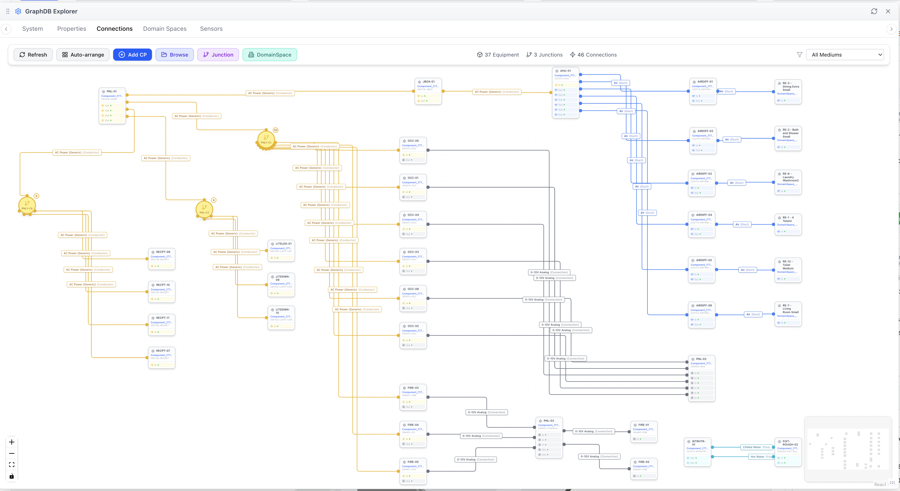
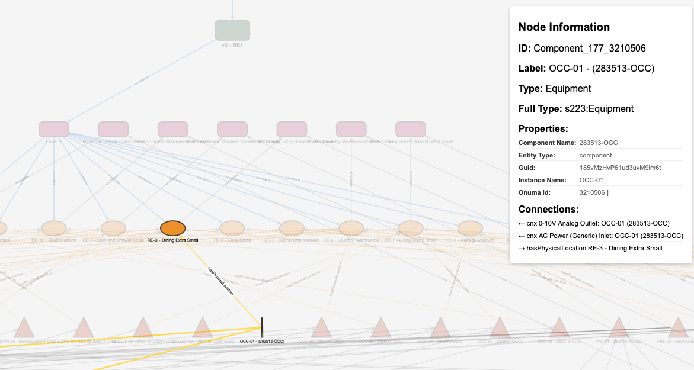

# RE1 BIM and RDF

This apartment with 11 spaces is used to experiment with the Semantic Model and a tiny federatated BIM (Architectural, Mechanical, Electrical, Plumbing) to explore the relationships and properties of:

* location of assets in spaces (rooms)
* connection of assets to their systems
* electical connecions
* sensors connections

## Visualization

### Semantic Bridge: 

*In the Semantic Bridge, we can review the semantic model stored in a combination of SQL CloudBIM store and the GraphDB Tripple-Store.*

### Turtle File Visualization: 

*HTML Visualization Tool:* 
[RE1-RDF Visualization](https://onuma.com/RDF-viz/re1-223p-visualization.html)

## Time-Series Data

[Time-Series Data in Sample Model](time-series/README.md)