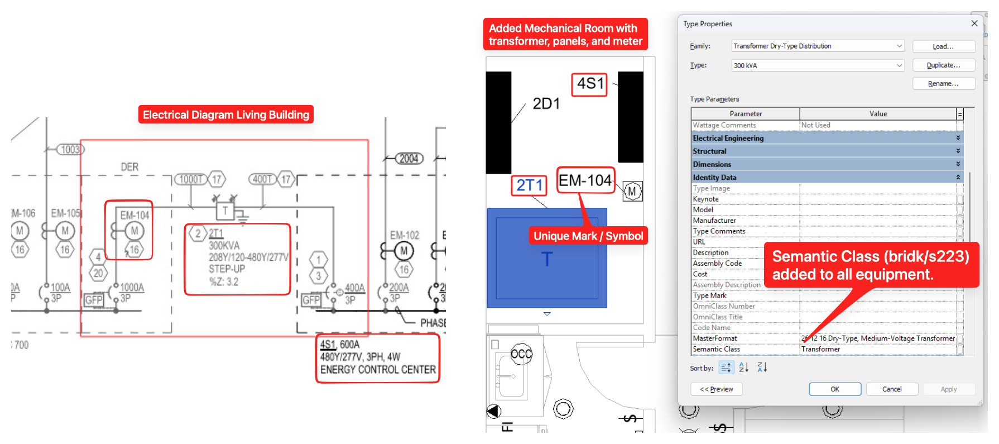

# Revit BIM

Revit R25 model (Architectural, Mechanical, Electrical, Plumbing).

All 3 MEP files are linked from the Architectural model.

All assets in the 3 MEP models have unique values for the instance parameter "Mark". These symbols are used on Schedules and in the Semantic Model as identifiers.

**Updated version** of the BIM including a new Mechanical Room with Transformer, Meter, and Panels.

All Assets in this updated version also have a type parameter "Semantic Class" which contains either the s223 or the brick class. This makes it easier to convert the model to a semantic model.

[RE1_Electrical_Schedule.xlsx](RE1_Electrical_Schedule.xlsx)

[Revit R25: RE1 Revit 2025_2026-02-20](../revit-bim/RE1 Revit 2025_2026-02-20.zip)

