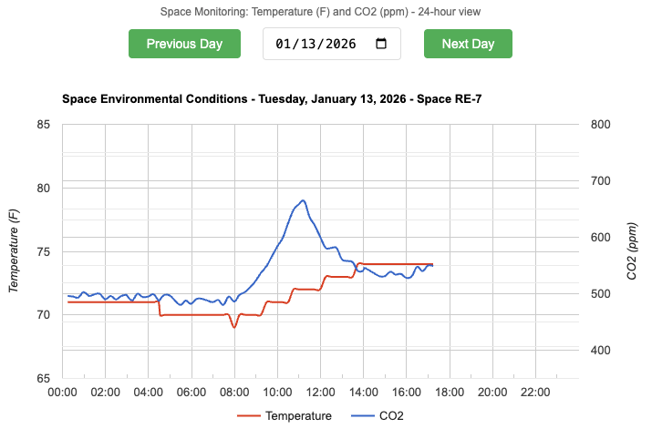

# RE1 Time-Series Data

The sample model contains 2 temperature sensors in rooms RE-1 and RE-7 and one CO2 sensor in RE-7. The Sensor data is stored in a Time-Series Database (TSDB) and retrieved for analytical reviews.

## Sensor data

**The links are limited to the last 30 days**. Update the URL specifying a date from the last 30 days.

### Temperature Sensors

[Temperature for Ferbruary 13, 2026](https://system.onuma.com/177/export/re1-space-data?date=2026-02-13&type=temp)

### CO2 Sensor:

[CO2 of RE-7 for Ferbruary 13, 2026](https://system.onuma.com/177/export/re1-space-data?date=2026-02-13&type=co2)

## Graph of reported sensor data

[Live Graph for space RE-7](https://www.onuma.com/RE1/time-series-graph.html?space=RE-7)
 


The attached version of the TTL file for this model includes examples of time-series data:
Row 1488 through 1513:

```
:bacnet_xref_ObservableProperty_177_3594_RE_7_Temperature_589 a s223:BACnet_ExternalReference ;
    rdfs:label "RE-7 Temperature" ;
    bacnet:device-address "10.220.0.60" ;
    bacnet:device-identifier "device,2005" ;
    bacnet:object-identifier "analog-input,425" ;
    bacnet:object-name "AI1000425_Sheddable" ;
    bacnet:object-type "analog-input" ;
    bacnet:present-value "70.0"^^xsd:float ;
    bacnet:property-identifier "present-value" .

:timeseries_xref_ObservableProperty_177_3594_RE_1_Temperature_81276 a :TimeseriesReference ;
    :hasTimeseriesId "TSTAT-02" ;
    :storedAt """
{
  "connection_type": "http_api",
  "base_url": "https://system.onuma.com/177/export/re1-space-data",
  "params": {
    "type": "temp",
    "space": "RE-1",
    "date": "2026-01-29",
    "id": "TSTAT-02"
  },
  "timestamp_column": "TimeStamp",
  "value_column": "Temp"
}
""" .
```
Example URLs for the above timeseries:

[Space RE-7](https://system.onuma.com/177/export/re1-space-data?date=2026-02-10&space=RE-7)

[Thermostat](https://system.onuma.com/177/export/re1-space-data?date=2026-02-10&id=TSTAT-01)

[CO2](https://system.onuma.com/177/export/re1-space-data?date=2026-02-10&type=co2)

[Temperature](https://system.onuma.com/177/export/re1-space-data?date=2026-02-10&type=temp)