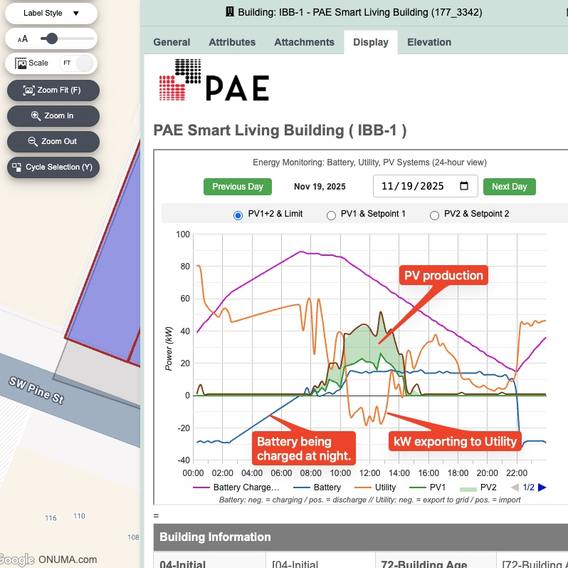
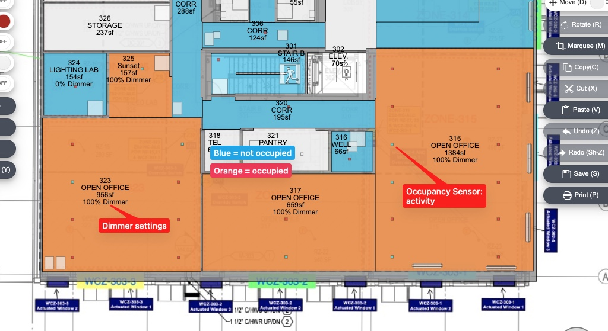

# Displaying sensor data

The CMMS System in the cloudBIM displays the sensor data with various views supporting the facilities team with an easy to use interface. They can react to any annomalities quickly and adjust the BAS settings.

## Plan views and graphic displays

### At building level, Battery, Utility, and PV data shows any anormalities: 

*While the building is making use of the lower cost of energy during the night being recharged, solar and battery power are used during the time of the day when power from the grid is at its highest.*

### Live occupancy and lighting level sensor data is being displayed in the PAE Living Building:

*Switching between **Occupancy & Lighting Level** views and **Temperature** views supports optimizing energy usage and comfort for the occupants.*

### Historic sensor data is visible in graphs:

